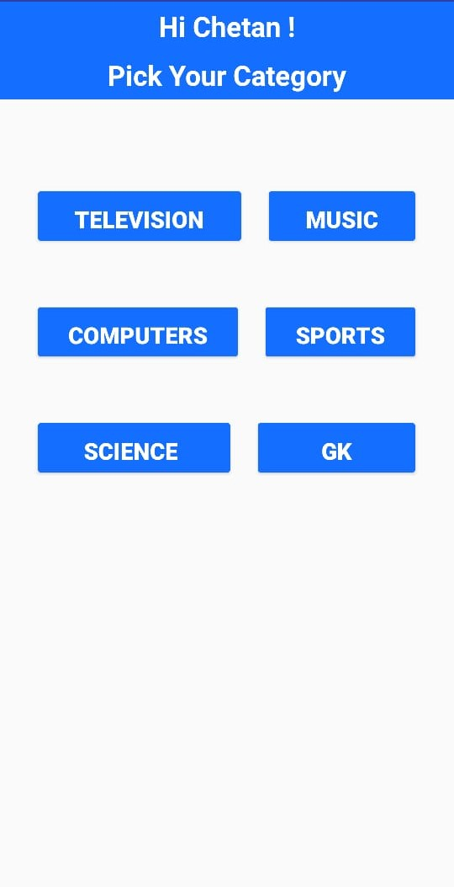
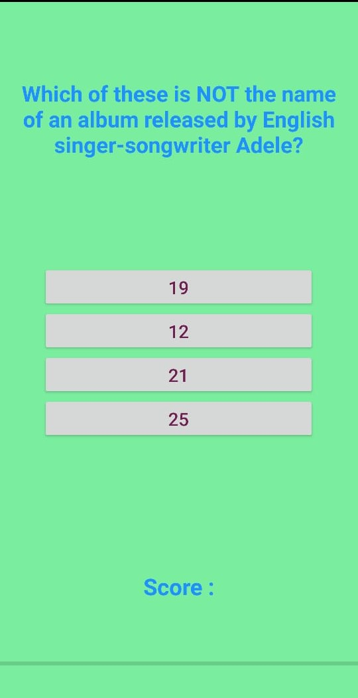
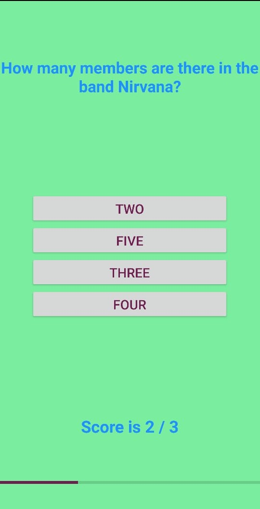
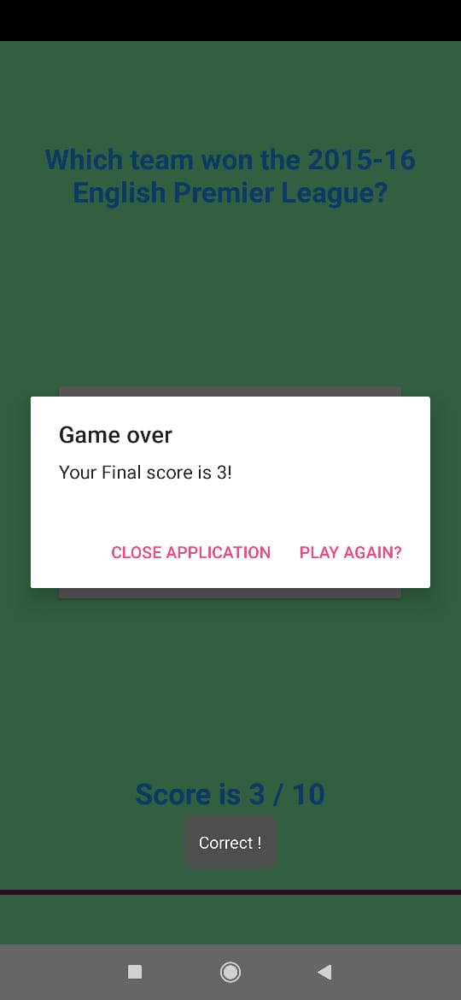

# Quizzler
One of the many android applications created by me from scratch using Android Studio. 
Quizzler basically is a quiz application that allows users to answer questions from category they will select.
It includes science, general knowlegde ,music , television, sports and many more.
Features like current score, progress bar and play again option are present making the application reusable and dynamic.
All the questions are fetched from API and are not hardcoded.

